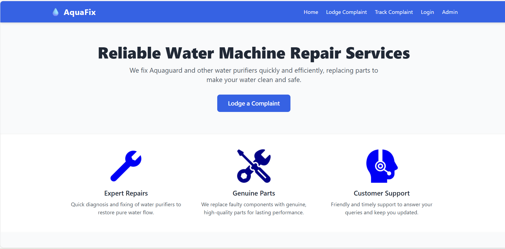
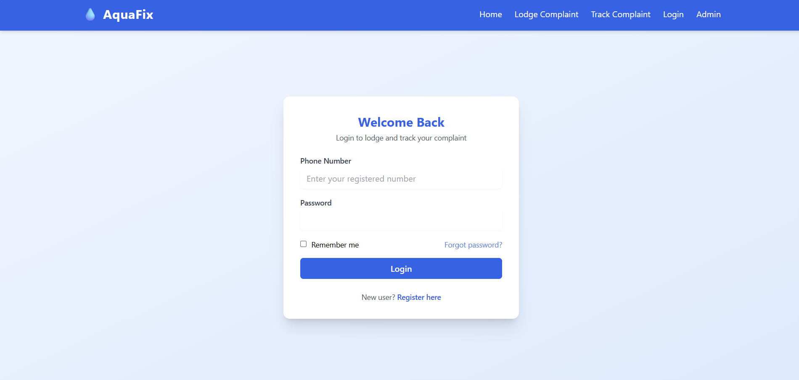
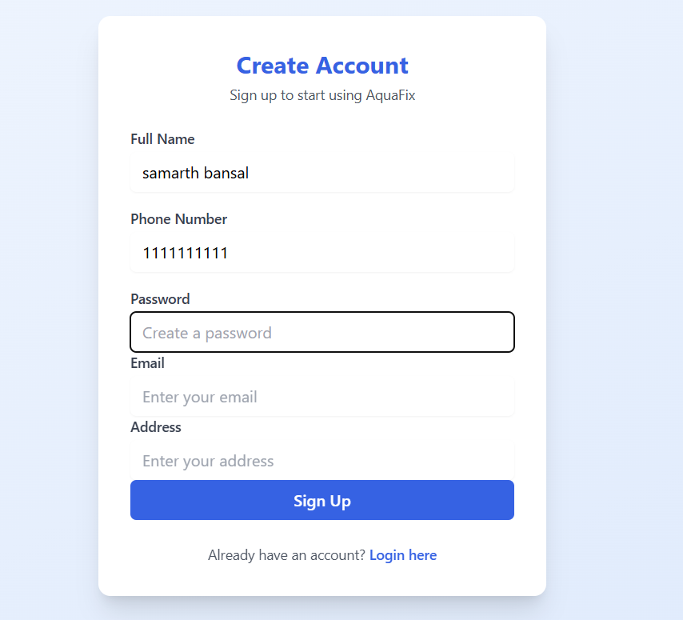
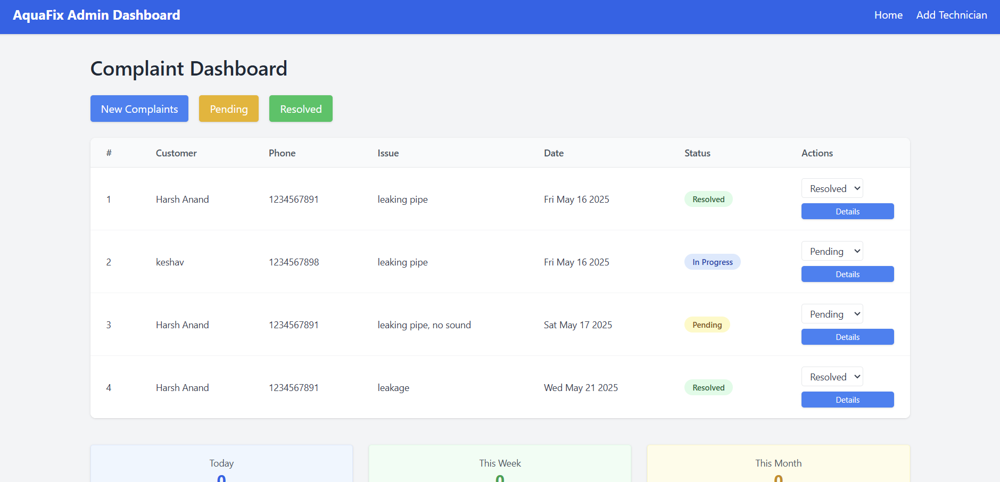
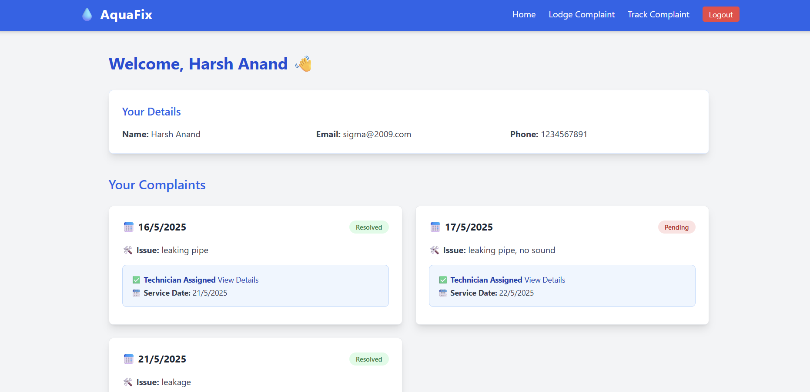
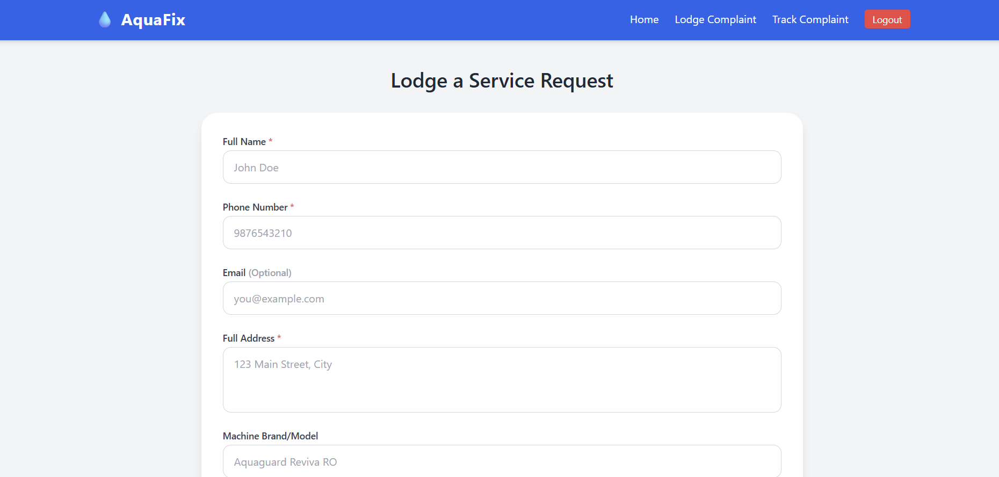
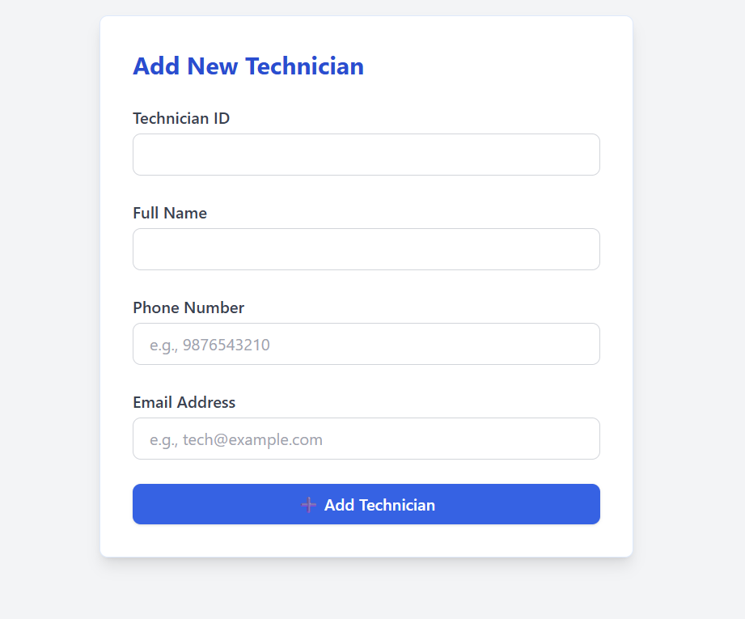
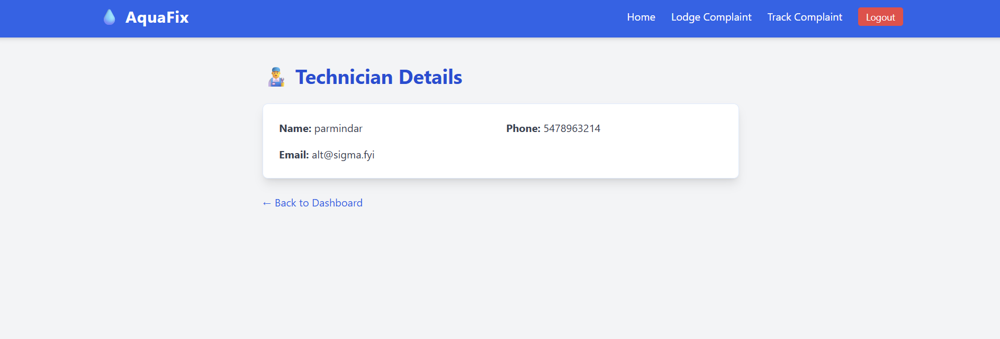
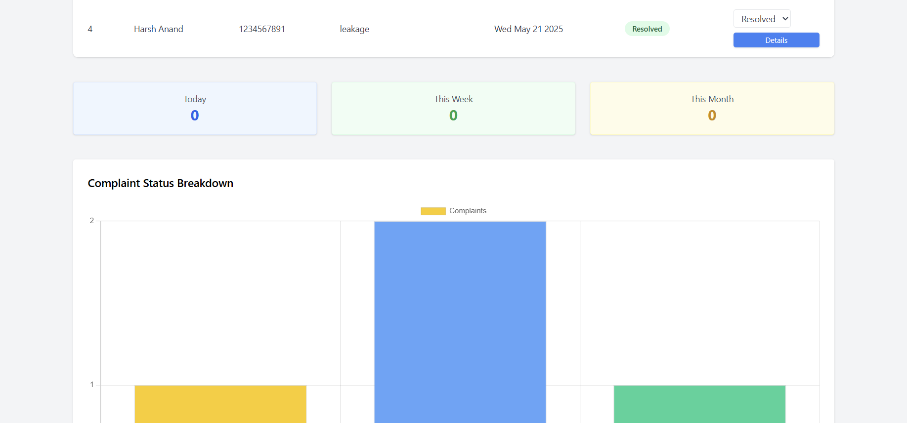

# 💧 Water Purifier Complaint Management System

A full-featured complaint registration and resolution platform tailored for water purifier service businesses. It allows customers to register issues and track their progress, while admins can manage technicians, assign tasks, and monitor complaint stats — all from a clean dashboard.

---

## 🚀 Features

### 👤 User Module
- Sign up & login
- Lodge new complaints with address & phone number
- Track complaint status
- View assigned technician details

### 🛠️ Admin Module
- Admin login and dashboard
- View and manage all complaints
- Assign technicians to complaints
- Add new technicians
- View complaint statistics

---

## 🧱 Tech Stack

| Layer        | Technology           |
|--------------|----------------------|
| Frontend     | HTML, Tailwind CSS, EJS |
| Backend      | Node.js, Express.js  |
| Database     | MongoDB (Mongoose)   |
| View Engine  | EJS                  |
| Session Mgmt | express-session      |

---

## 📸 Screenshots

### 🏠 Home Page  
  
> The main landing page where users can navigate to log in or sign up. It introduces the complaint system with a clean layout.

### 🔐 Login Page  
  
> Secure login page for users to access their dashboard using phone number and password.

### 📝 Signup Page  
  
> Registration form for new users to create an account by providing name, email, phone, password, and address.

### 👨‍💼 Admin Dashboard  
  
> Central dashboard for the admin to view and manage complaints, assign technicians, and access analytics.

### 👤 User Dashboard  
  
> Personalized dashboard for users showing all submitted complaints and their statuses.

### 🧾 Lodge Complaint Page  
  
> Page where users can submit a new complaint about their water purifier issue by filling in required details.

### ➕ Add Technician  
  
> Admin panel to add new technicians by entering their name and contact information.

### 📋 Assigned Technician Details  
  
> Section displaying technician information assigned to a complaint — name and contact for follow-up.

### 📊 Statistics Dashboard  
  
> Visual overview for the admin showing total complaints, resolved cases, and technician workload.


## ⚙️ Getting Started

### 🔧 Installation

Clone the repository and install dependencies:

```bash
git clone https://github.com/your-username/project-aqua.git
cd project-aqua
npm install


